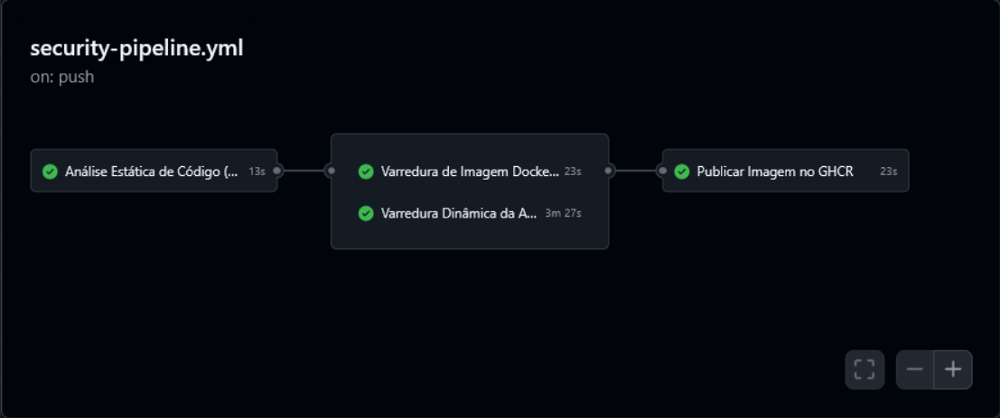

# 🛡️ SecOps-LAB

Pipeline de **DevSecOps** construído do zero no GitHub Actions, integrando análise estática, varredura de imagem de container e varredura dinâmica de aplicação — com gate automático de publicação: a imagem só é publicada se **todas** as camadas de segurança passarem.

```
push/PR → SAST (Semgrep) → ┬─→ SCA de Imagem (Trivy) ─┬─→ Publish (GHCR)
                            └─→ DAST (OWASP ZAP)  ─────┘
```

## 🎯 Objetivo

Simular, em escala reduzida, um pipeline de segurança de aplicação como os usados em times de AppSec/DevSecOps: **shift-left** (achar problemas o mais cedo possível) combinado com um **gate de qualidade** que impede que código ou imagens vulneráveis cheguem a produção.

## 🧱 Arquitetura do pipeline

| Job | Ferramenta | O que verifica | Bloqueia o build? |
|---|---|---|---|
| `sast-scan` | [Semgrep](https://semgrep.dev/) | Padrões inseguros no código-fonte (SAST) | Sim (falhas do Semgrep) |
| `container-scan` | [Trivy](https://github.com/aquasecurity/trivy) | CVEs na imagem Docker (SCA) | Sim, em `CRITICAL`/`HIGH` (configurável) |
| `dast-scan` | [OWASP ZAP](https://www.zaproxy.org/) Baseline | Vulnerabilidades na API em execução (DAST) | Reporta (não bloqueia por padrão) |
| `publish` | Docker Buildx | Build + push para o GHCR | Só roda se `container-scan` **e** `dast-scan` terminarem |

O `container-scan` e o `dast-scan` rodam **em paralelo** (ambos dependem só do `sast-scan`), economizando tempo de execução.

## 🔍 Decisões técnicas

**Por que Alpine + `apk upgrade` no Dockerfile?**
A imagem base `python:3.12-alpine` reduz superfície de ataque, mas ainda carrega CVEs do sistema operacional. Rodar `apk update && apk upgrade` no build elimina as vulnerabilidades `HIGH`/`CRITICAL` do SO antes mesmo de instalar as dependências Python — o Trivy passou de várias vulnerabilidades para **zero** `HIGH`/`CRITICAL` só com essa mudança.

**Por que `exit-code` configurável no Trivy?**
A severidade que bloqueia o build é um input de `workflow_dispatch` (`CRITICAL,HIGH` por padrão), permitindo rodar o pipeline manualmente com um limiar diferente sem editar o YAML — útil pra investigar vulnerabilidades de severidade mais baixa sem travar o CI.

**Por que o DAST não bloqueia o build (`fail_action: false`)?**
O ZAP Baseline Scan reporta tanto achados críticos (`FAIL`) quanto avisos de hardening (`WARN`), como headers de segurança ausentes. Bloquear o build em qualquer `WARN` geraria muito ruído para uma API de demonstração; o pipeline está configurado pra falhar apenas em `FAIL`, mantendo o relatório completo disponível como artefato para revisão manual.

**Headers de segurança HTTP**
A API expõe um hook `after_request` no Flask que adiciona `X-Content-Type-Options`, `Content-Security-Policy`, `Permissions-Policy`, `Cross-Origin-Resource-Policy` e remove o header `Server` das respostas da aplicação — isso resolveu a maioria dos `WARN` do ZAP (de 7 para 4 nos testes).

**Limitação conhecida: header `Server` em rotas 404**
Nas rotas não mapeadas (ex. `/robots.txt`, `/sitemap.xml`), o servidor de desenvolvimento do Flask (Werkzeug) injeta seu próprio header `Server` no nível de protocolo HTTP — **antes** da resposta passar pelo hook `after_request` da aplicação. Por isso, o header some na rota raiz (`/`) mas persiste nos 404 automáticos. Em produção, rodando atrás de um servidor WSGI como Gunicorn, esse comportamento muda. Optou-se por documentar essa limitação em vez de mascará-la.

**`continue-on-error` no step do ZAP**
A action `zaproxy/action-baseline` tenta subir um artefato interno (`zap_scan`) que ocasionalmente falha com `400 Bad Request` — um bug conhecido e documentado na comunidade do GitHub Actions, do lado do serviço de artefatos, não do projeto. Para não travar o pipeline por causa disso, o step usa `continue-on-error: true`; os relatórios do ZAP (HTML/JSON/MD) são publicados de forma confiável por um step próprio (`actions/upload-artifact`) logo em seguida.

## 🚀 Como rodar

O projeto foi desenvolvido num ambiente sem suporte a virtualização (BIOS sem VT-x habilitado), então **todo o ciclo de build e scan roda no GitHub Actions** — não há necessidade de Docker local para validar o pipeline.

```bash
git clone https://github.com/thelimacosta/SecOps-LAB.git
cd SecOps-LAB
# qualquer push para main (ou PR) dispara o pipeline automaticamente
```

Para rodar manualmente com uma severidade de Trivy diferente:
Actions → DevSecOps Security Pipeline → Run workflow → escolha a severidade.

## 📁 Estrutura

```
SecOps-LAB/
├── .github/workflows/
│   └── security-pipeline.yml   # pipeline completo (SAST + SCA + DAST + publish)
└── app/
    ├── app.py                  # API Flask
    ├── requirements.txt
    └── Dockerfile
```

## 🖼️ Resultado



Pipeline passando com todas as camadas verdes: SAST sem findings, Trivy com zero vulnerabilidades `HIGH`/`CRITICAL`, e ZAP Baseline sem `FAIL-NEW`.

## 🔮 Próximos passos possíveis

- [ ] Dependabot/Renovate para scan automatizado de dependências
- [ ] Rodar a imagem publicada atrás de Gunicorn, eliminando a limitação do header `Server` em 404s
- [ ] Badge de status do workflow no topo deste README

---

**Autor:** [Matheus Costa](https://github.com/thelimacosta)
